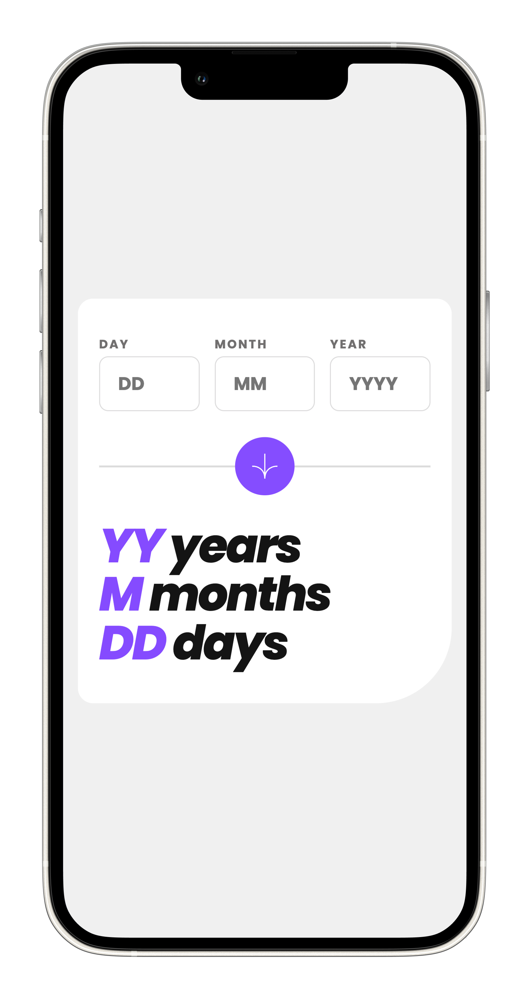

# Age Calculator App

This is results summary of age calculator made with HTML, CSS & Javascript.

## Table of contents

- [Overview](#overview)
  - [Links](#links)
  - [Built with](#built-with)
  - [Screenshot](#screenshot)

### Links

- Repository URL: [Github Repository](https://github.com/waldvoid/Front-end-Demos/tree/main/Age%20Calculator%20App)
- Live Site URL: [Live Page](https://agecalculator-merte.netlify.app)

### Built with

- Semantic HTML5 markup
- CSS custom properties
- Flexbox
- Mobile-first workflow
- Javascript
- Webpack & Babel Dependency Management
- ARIA Accessibility

### Screenshots

