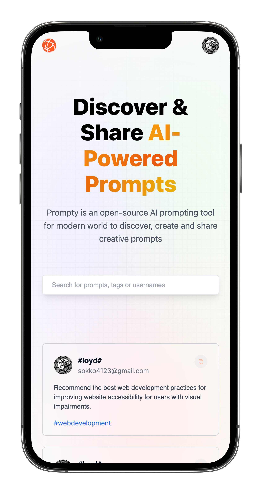

# Prompty - AI Prompt Tool Web Page

Prompty is an AI Prompts Web Page that allows people to share the most useful prompts with each other about any topic. Made with next.js, reach & tailwind css.

## Table of contents

- [Overview](#overview)
    - [Links](#links)
    - [Built with](#built-with)
    - [Screenshot](#screenshot)

### Links

- Repository URL: [Github Repository](https://github.com/waldvoid/Front-end-Demos/tree/main/Prompty%20-%20AI%20Prompt%20Tool)

### Built with

- Semantic markup
- Tailwind CSS
- React
- Next.js
- Next auth. (3rd pt & local)

### Screenshots

