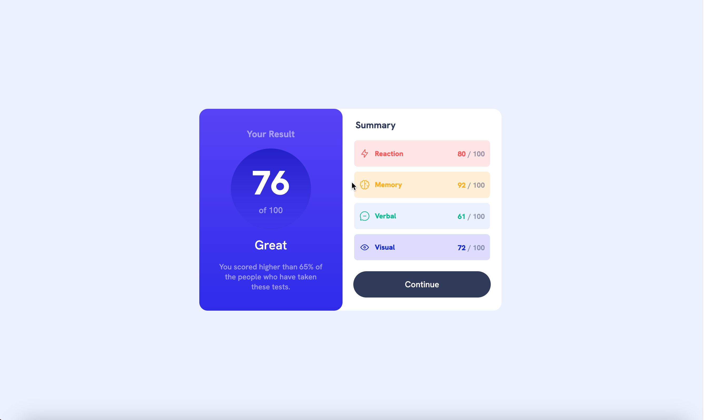
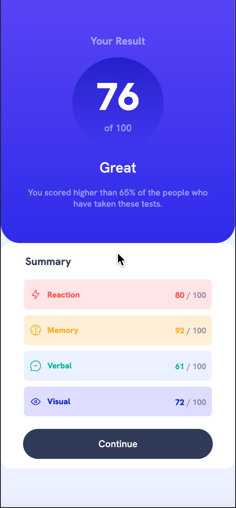

# Results summary component

This is results summary component made with HTML & CSS.

## Table of contents

- [Overview](#overview)
    - [Screenshot](#screenshot)
    - [Links](#links)
    - [Built with](#built-with)

### Screenshots

### Links

- Repository URL: [Github Repository](https://github.com/waldvoid/Front-end-Demos/tree/main/ResultsSummaryComponent)
- Live Site URL: [Live Page](https://rsccomponent-merte.netlify.app)

### Built with

- Semantic HTML5 markup
- CSS custom properties
- Flexbox
- CSS Grid
